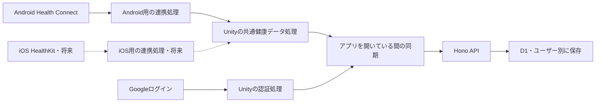

# Health Connect連携とiOS拡張の実装計画

状態：進行中（Android向けコードと自動テストを追加。OAuth設定・実機確認は未完了）
作成日：2026-09-10
更新日：2026-09-13

Unityクライアントで健康データを読み取り、認証済みユーザーのデータとして `server/` に保存する。
AndroidのHealth Connect連携を先行し、後からiOSのHealthKit連携を追加できる構成にする。
ユーザーの実装依頼を受け、初期案の歩数・直近7暦日・読み取り専用を採用した。
実装後の動作、設定方法、現在のコード配置は [健康データの機能文書](../features/health-data.md) を参照する。
以下の計画上の配置案は、実装中に更新されたclient・serverの配置ルールへ合わせて変更した。

2026-09-13の追加依頼では、[Google認証からHealth Connectの一覧・JSON詳細を表示する計画](2026-09-13-health-connect-local-display.md)を先行する。
Googleサインインの後にHealth Connectへ接続し、バックエンド接続・アプリ側の永続化を使わずに表示する実行経路を用意する。

## 合意済みの範囲と初期案

| 項目 | 方針 | 決定状況 |
|---|---|---|
| 実装対象 | Androidを先行し、iOSは拡張を考慮した設計まで | 合意済み |
| 同期するタイミング | アプリを開いている間のみ。バックグラウンド処理を設けない | 合意済み |
| 権限対応 | 拒否、取り消し、再許可を扱う | 合意済み |
| 画面 | アプリ独自のログイン・健康データ画面は後続作業 | 合意済み |
| 外部連携 | 無料の既存Unity用プラグインを優先する | 合意済み。[共通指示](../../AGENTS.md)に記載済み |
| 認証 | AndroidのGoogleログインにUMothを使う | 導入・Androidビルド済み。OAuth設定と実機検証は未完了 |
| 最初のデータ | 歩数の日別集計から開始する | 実装依頼に基づき初期案を採用 |
| 初期取得期間 | 当日を含む直近7暦日を毎回読み直す | 初期案を採用 |
| 健康データの操作 | 端末からの読み取りとサーバーへの保存・取得を先行する | 初期案を採用。Health Connectへの書き込みは含めない |

バックグラウンド権限、定期ジョブ、常駐サービス、アプリ終了後の再送は追加しない。
OS標準の認証・権限画面と、必要な権限用途の説明は連携に必要なため、独自画面を後回しにする場合も用意する。
健康データをスマホや他のアプリが記録するタイミングと、本アプリが読み取るタイミングは別に扱う。

## 計画時点の実装と接続先

Unityは [ProjectVersion.txt](../../client/ProjectSettings/ProjectVersion.txt) の `6000.6.0f1` を使用している。
[パッケージ設定](../../client/Packages/manifest.json)と `client/Assets/Scripts/Runtime/` には、認証・健康データ連携はまだない。

サーバーはHonoで、確認時点の作業ツリーにはWorkersのエントリーポイント、D1の `DB` バインディング、疎通確認用の `/health` と `/ready` がある。
認証・健康データのAPIと業務テーブルは未実装である。
Workers・D1への変更は並行作業中のため、着手時にコード、マイグレーション、起動・検証手順の確定状態を確認し、その構成に追加する。
この計画のためにサーバー基盤を作り直さない。

参照：[アプリ](../../server/src/app.ts)、[エントリーポイント](../../server/src/index.ts)、[開発手順](../rules/backend-design.md)、[クライアントCI計画](2026-09-10-client-ci-backlog.md)。

## クライアントとサーバーの責務

| 処理 | 責務 |
|---|---|
| OSごとの健康データ連携 | 利用可否、権限要求、設定への案内、データ読み取り、共通形式への変換 |
| Unityの共通処理 | データの状態、取得期間、同期の開始・停止、失敗時の結果を管理する |
| Unityの認証処理 | Googleログインとアプリのログアウトを扱い、サーバーのセッションを保持する |
| サーバー | Googleの本人確認、セッション管理、所有者の確認、入力検証、保存・取得を行う |
| D1 | アプリ内ユーザー、認証IDとの対応、セッション、取得元別の日別データを保存する |

サーバーからHealth ConnectやHealthKitへ直接問い合わせる処理は設けない。
サーバーが返すのは最後に受け取ったデータであり、端末の現在値とは限らない。

## iOSを追加できる共通インターフェース

OS固有の型やプラグインの戻り値を、同期処理へ直接渡さない。
健康データ取得とAPI通信に小さなC#インターフェースを置き、Android実装とテスト用実装を用意する。
配置ルールに合わせた実装時点の構成は次のとおり。

| 配置・名前 | 用途 |
|---|---|
| `client/Assets/Baryonyx/Features/Health/Runtime/` の `IHealthDataProvider` | 利用可否と権限の確認、権限要求、直近7暦日の読み取り |
| 同フォルダーの `HealthConnectProvider` | 無料プラグインまたは必要最小限のAndroid連携コードを呼ぶ |
| 同フォルダーの `HealthSyncService` | ログインとアプリ状態を確認し、取得結果をサーバーへ送る |
| 同フォルダーの `HealthClient` | UMothを通じたログイン・ログアウトとセッションを扱う |
| 同フォルダーの `IHealthApi` と `HealthApiClient` | 認証済みのAPI通信と通信エラーを扱う |
| `client/Assets/Baryonyx/Features/Health/Tests/EditMode/` のテスト用Provider | Unity Editorで拒否・空データ・取り消し・復帰を再現する |

当初案の `IAuthProvider` は独立させず、現在は `HealthClient` が認証を担当している。
iOS認証を追加するときに、採用する認証方式に合わせて分離する。
EditorやWebではネイティブプラグインを読み込まず、実行環境に応じて未対応の結果を返す。
テストでのみ明示的にテスト用Providerを選び、架空の健康データを通常のサーバーへ送らない。

## 権限の拒否・取り消し・再許可

権限と取得結果を別々に管理する。
権限はデータ項目ごとに扱い、単一の `isConnected` だけで判断しない。

| 種類 | 共通処理が扱う状態の案 |
|---|---|
| 利用可否 | 利用可能、OS・端末が未対応、インストール・更新が必要 |
| 読み取り権限 | 許可済み、未許可、判定不能 |
| 読み取り結果 | 値あり、取得できた値なし、権限不足、読み取り失敗、キャンセル |
| 同期結果 | 未実行、実行中、保存成功、取得値なし、認証が必要、失敗、中断 |

Androidでは使用する直前に必要な権限を確認し、確認後に取り消される場合のエラーも処理する。
初回拒否では読み取りを行わず、再試行操作や設定確認につながる結果を返す。
設定から戻ったときは状態を再確認し、再許可されていれば次の同期で取得を再開する。
起動・復帰のたびに権限ダイアログを自動表示することは避け、権限要求は明示的な連携・再試行操作から呼ぶ。[Androidの導入ガイド](https://developer.android.com/health-and-fitness/health-connect/get-started)

**iOSでは読み取り権限の許可・拒否を判別できない。**
HealthKitの認可状態APIが返す書き込み権限を、読み取り権限として使わない。
権限要求の完了も「読み取り許可済み」とは解釈せず、共通状態は「判定不能」を許容する。
空の結果から拒否・取り消し・データ未記録を区別せず、取得できた値がないと扱う。[Appleの認可状態API](https://developer.apple.com/documentation/healthkit/hkhealthstore/authorizationstatus%28for%3A%29)

取り消しや空の結果を「0歩」へ変換しない。
過去に保存した値は取得日時付きの履歴として残し、今回も取得できた値として返さない。
健康データの許可取り消し、Googleログアウト、サーバー上のデータ削除は別の操作とする。

## アプリを開いている間の同期

初期案では、ログインと健康データ連携が済んでいる場合に、起動後・通常の復帰後・明示的な更新操作から同期を開始する。
同時に複数の同期を走らせず、短時間に続く復帰通知は一つにまとめる。

1. ログイン状態、アプリが操作可能な状態、取得元の利用可否を確認する。
2. 対象項目の権限を確認し、取得できる範囲を読み取る。
3. 読み取り結果を共通形式へ変換する。
4. 同じユーザーでログイン中か、送信前に再確認する。
5. サーバーへ送信し、保存完了後に最終同期成功時刻を更新する。

アプリが背面に移ったら新しい取得・送信を開始せず、進行中の処理は可能な範囲でキャンセルする。
すでにサーバーへ届いた要求は保存される可能性があるため、復帰後の再送で二重計上しない設計にする。
OSのログイン・権限画面による一時的なフォーカス喪失では、元の要求の結果を受け取れるようにする。
結果を受け取っても、アプリが前面に戻り、ログイン状態を再確認するまで健康データ同期を続行しない。

通信に失敗した場合は、次の前面での同期時に期間全体を読み直す。
初期実装では健康データの永続的な送信待ちキューを設けない。
ログアウト・ユーザー切り替え時は、処理を中断して未送信データを破棄し、遅れて返った結果も破棄する。

## 歩数の取得・保存方法の初期案

Androidの歩数はHealth Connectの集計APIで取得する。
複数の記録元の生レコードをアプリで単純合算することは避ける。[Androidの読み取りガイド](https://developer.android.com/health-and-fitness/health-connect/read-data)
将来のiOS実装ではHealthKitの統計クエリを使う案とし、同じ期間・単位へ変換する。[Appleの統計クエリ](https://developer.apple.com/documentation/healthkit/executing-statistics-collection-queries)

保存するのは日別の取得時点の集計値とする。
同じ日を再取得したら置き換え、歩数を加算しない。
期間内の記録の修正・削除によって値が減った場合も更新する。

| 保存情報の案 | 用途 |
|---|---|
| アプリ内ユーザーID | 認証済みの所有者。サーバーが決定する |
| Provider・取得元ID | Health Connect / HealthKitと、アプリインストール単位の取得元を区別する |
| 項目・単位 | 初期案は `steps`・`count` |
| 対象日・タイムゾーン・集計区間のUTC開始終了 | 日付境界と夏時間を明確にする |
| 値・取得結果 | 整数の歩数と、値を得られなかった状態を区別する |
| 取得時刻・サーバー受信時刻・更新版 | データの新しさと再送・競合を扱う |

当日の集計終了は取得時刻とし、日付・タイムゾーンを日別更新のキーに含める。
更新では取得元単位の版管理を使い、古い再送が新しい値を上書きしないようにする。
通信再送の識別子と版の発行方法はAPI実装時に定め、競合テストで確認する。
端末時計だけを更新順序の根拠にしない。

空の結果を受けた日は、今回の値が得られなかったことを記録する。
以前の数値を履歴として残す場合も、最新の確認で値を得られなかったことをAPIで区別できるようにする。
iOSでは空の結果だけから元データの削除を断定できないため、サーバーの履歴も自動削除しない。
7暦日より前の変更と、長期間起動しなかった間の全履歴回収は、この初期案では保証しない。

同じユーザーがAndroidとiOS、または複数端末から送った集計は取得元別に保存する。
取得APIは取得元を指定して返し、初期のクライアントは自分の取得元を使う。
端末間の同じ歩数を識別できないため、合計値を自動で足し合わせない。
将来、複数端末をまとめて表示する場合は、表示する取得元の選択方針を別途定める。

## 認証とサーバーAPI

UMothはAndroidのGoogleログインに利用する。
公開説明上、iOS側の対応はApple IDログインであり、iOSのGoogleログインまで同じプラグインで揃うとは扱わない。[UMoth](https://github.com/Uralstech/UMoth)

サーバーはGoogle IDトークンの署名、発行元、対象クライアント、有効期限を検証し、`sub` を認証IDとしてアプリ内ユーザーに対応付ける。
メールアドレスをユーザーの主キーにしない。[Googleのバックエンド認証ガイド](https://developers.google.com/identity/sign-in/web/backend-auth)
Workersで動作する検証ライブラリを実装時に選び、セッション発行・検証をHonoへ追加する。

| APIの責務案 | 処理 |
|---|---|
| ログイン | Google IDトークンを検証し、有効期限付きのアプリセッションを発行する |
| ログアウト | 現在のアプリセッションを失効する |
| 健康データ保存 | 認証済みユーザーの取得元と期間を検証し、日別データを更新する |
| 健康データ取得 | 認証済みユーザー自身のデータと取得・同期状態を返す |

初期案はランダムなセッショントークンを使い、サーバーにはそのハッシュと有効期限を保存する。
クライアントはトークンをメモリに保持し、再起動・期限切れ時は再認証する。
永続ログインを追加する場合は、保存先と更新処理を別途設計する。
ログアウトはローカル状態を先に破棄し、通信できる場合はサーバーでも失効する。
オフラインで失効できないセッションは期限まで残るため、期限とそのテストを実装時に確定する。

ユーザーIDは要求本文を信用せず、セッションから決定する。
取得元の所有者、日時・範囲・単位・値・要求サイズを検証する。
生の健康データやトークンをログへ残さず、個人別APIの応答はキャッシュさせない。
APIの詳細な型と検証規則は実装コードを正とし、この文書へ重複したスキーマを持たせない。

将来のiOS認証では、Googleログインを続けるかApple IDを追加するかを決める。
認証IDとアプリ内ユーザーを分離しておき、HealthKitの追加だけでユーザーテーブルを作り直さない。
異なる認証方法のアカウントを、メールアドレス一致だけで自動統合しない。

## 実装の順序と完了条件

| 順序 | 作業 | 完了条件 |
|---|---|---|
| 1 | 取得項目・期間を確定し、無料プラグインとAndroidビルドの適合性を確認 | 対象Unity・端末で権限要求と歩数取得ができ、ライセンスと依存関係を記録できる |
| 2 | 共通型・Provider・同期状態とテスト用実装を追加 | 拒否、判定不能、空データ、キャンセルをEditorテストで再現できる |
| 3 | UMothによるAndroid認証とサーバーセッションを追加 | ログイン、期限切れ、ログアウト、別ユーザーのアクセス拒否を確認できる |
| 4 | Health Connect Providerと前面での同期を追加 | 実機で読み取り、拒否、取り消し、再許可、設定からの復帰を確認できる |
| 5 | D1保存・取得APIと接続 | 実機から送った値を同じユーザーで取得でき、再送・値の減少・空データを正しく扱える |
| 6 | 一連の動作を検証し、機能文書へ反映 | 独自画面なしの検証用呼び出しで、認証から保存・取得まで完了する |
| 将来 | HealthKit ProviderとiOS認証を追加 | 共通同期処理を維持し、iPhoneで権限の判定不能・再許可・日別集計を確認できる |

無料の健康データ用Unityプラグインは、現時点で採用を確定していない。
有料のHealthBridgeは採用対象から外す。
無料候補が必要な権限・集計・ビルド条件を満たさない場合は、その不足を記録して、必要な読み取り機能だけのAndroid連携コードを自作する案へ進む。
AIによるコード生成を利用しても、Androidビルドと実機検証を完了条件から外さない。

着手時にはアプリ識別子、Google OAuthの対象クライアントと署名設定、検証端末、サーバー接続先を確認する。
Androidの最小OSは、Health Connectと採用するプラグインの対応範囲を照合して決める。
iOSの最低OS、Mac・Xcode・署名環境とiPhoneでの検証は、iOS実装時に用意する。

## 検証項目

| 層 | 検証する動作 |
|---|---|
| Unityの共通処理 | 未許可・判定不能・空データを0にしない。部分的な権限、二重起動、通信失敗、背面移行、復帰を扱う |
| 認証とユーザー切り替え | Googleログインのキャンセル、期限切れ、ログアウト後の遅延応答、別アカウントへの未送信データ混入を防ぐ |
| サーバー | 不正・期限切れトークン、別ユーザーの取得元、入力不正、再送、古い版の遅延到着、DB失敗を確認する |
| 日別データ | 日付境界、タイムゾーン変更、夏時間、歩数減少、値なし、複数取得元を確認する |
| Android実機 | 初回許可・拒否、取り消し、再許可、未対応・更新が必要な環境、歩行後の取得、読み取り途中の中断を確認する |
| ビルド | Unityの再コンパイル・Console、関連テスト、Androidビルド、Editor・Webでネイティブ依存を読み込まないことを確認する |
| 将来のiOS実機 | 拒否とデータ未記録を区別できない状態、設定変更後の再取得、HealthKit側の集計と日付境界を確認する |

サーバーの検査は実装時点のpackage.jsonとCIに合わせる。
Androidの権限や実歩数はビルド成功だけで合格にせず、[既存のCI計画](2026-09-10-client-ci-backlog.md)に沿って実機確認を残す。
配置を変更した場合は、参照パス、テストの検出、ビルド補助の実行、文書リンクの整合を確認する。
