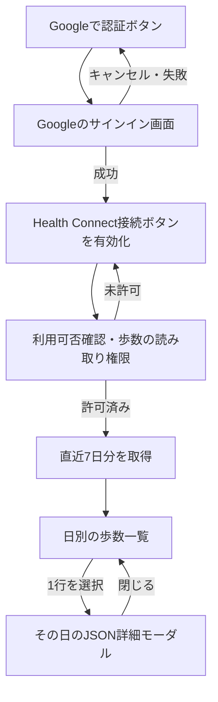

# Google認証からHealth Connectの一覧・JSON詳細を表示する計画

状態：進行中（実装・自動検証完了。OAuth設定・実機確認待ち）
作成日：2026-09-13
更新日：2026-09-13

Android実機で「Googleで認証 → Health Connectに接続 → 直近7日分の歩数一覧 → 選択した日のJSON詳細」を操作できるようにする。
バックエンド接続とアプリ側の永続化は引き続き対象外とし、認証状態・取得結果はメモリにだけ保持する。
前案の「Googleログインを使わない」という方針は、今回の操作順に合わせて変更する。

## 着手時の認証実装と今回の範囲

**着手時は認証の呼び出しコードだけがあり、認証ボタンと画面への組み込みは未実装だった。**
[HealthClient.cs](../../client/Assets/Baryonyx/Features/Health/Runtime/HealthClient.cs) はUMothでGoogleサインインを実行し、そのIDトークンをサーバーへ渡してアプリのセッションを作る。
初期化にはサーバーURLとGoogleクライアントIDが必要で、ログイン後に取得元IDをPlayerPrefsへ保存するため、今回の画面でそのまま利用すると「バックエンド接続・永続化なし」の条件を満たさない。
[サーバールート](../../server/src/features/health/routes.ts)にもIDトークンの検証・セッション発行コードがあるが、今回このAPIは呼ばない。
実際のOAuth設定と実機認証の完了は、現在のコードと[機能文書](../features/health-data.md)からは確認できない。

今回の「認証成功」は、Googleのサインイン処理が資格情報を返したことを指す。
サーバーによる本人確認・ユーザー作成・セッション発行は行わず、既存の `HealthSession` を仮の値で作って同期処理を動かす方式も採らない。
IDトークンは今回送信先がないため表示用モデルへ渡さず、認証結果を受け取った後に保持する必要のない資格情報は破棄する。
Google認証の外部通信は必要になり得るため、オフライン確認は認証成功後のHealth Connect読み取りを対象にする。[Google公式のサインイン説明](https://developer.android.com/identity/sign-in/credential-manager-siwg)

GoogleサインインとHealth Connectの読み取り許可は別の状態として管理する。
Health Connectは端末上のデータへアプリ単位の許可でアクセスする仕組みであり、Googleアカウントの選択をHealth Connectの取得元切り替えに使わない。
今回の「認証してから接続する」という順序はアプリの操作ルールとする。[Health Connectの構成と権限](https://developer.android.com/health-and-fitness/health-connect/architecture)

## 操作順と状態



| 状態 | 画面と操作 |
|---|---|
| 未認証 | 「Googleで認証」を有効にする。Health Connect接続・一覧・更新は利用できない |
| 認証中 | 処理中表示を出し、認証の連打を受け付けない |
| 認証成功・未接続 | 認証済み表示と「Health Connectに接続」を有効にする。Google認証の直後にOSの健康データ権限画面を自動表示しない |
| 認証キャンセル・失敗 | 未認証へ戻す。キャンセルと設定不足・通信等の失敗を区別し、再試行できるようにする |
| 接続中 | 利用可否を確認し、権限があれば取得へ進み、なければOSへ要求する |
| 権限拒否 | Google認証済みの状態を維持する。再接続・Health Connect設定への導線を出す |
| 未対応・更新が必要 | 状態を表示する。対応可能な場合はインストール・更新への導線を出す |
| 読み取り中 | 更新を重複実行させない。古い一覧・JSON詳細は閉じて破棄する |
| 読み取り成功 | 7日分を表示する。全日が値なしでも、読み取り失敗と区別する |
| 読み取り失敗 | 失敗を表示し再試行を可能にする。Google認証はやり直させない |
| 詳細表示中 | 背面の一覧・更新操作を遮断し、閉じる操作で元の一覧位置へ戻す |
| サインアウト | 認証状態・連携状態・一覧・JSON詳細を先に破棄して未認証へ戻す。遅れて届く応答を反映しない |

実装では、設定不足・Editor未対応を区別している。
UMoth 1.0.3はキャンセルと一部の失敗を同じエラーとして返すため、この2つは「認証を完了できませんでした」という案内にまとめ、再試行を受け付ける。

権限要求は明示的な接続操作からだけ行い、拒否後に自動で繰り返さない。
OSが前回の許可を保持していても、新しいアプリ起動後は「Google認証 → Health Connect接続」の操作順を通す。
サインイン状態をアプリで永続化せず、再起動後は認証ボタンから始める。
Google側がアカウントや同意を保持している場合、毎回パスワード入力が発生するとは限らない。

接続操作済みの実行中セッションでは、設定・通常の背面移行から戻った際に権限を確認し、許可済みなら一度再取得する。
通常の背面移行・画面破棄では読み取りを中断する。
OSの認証・権限画面への遷移中はその結果を待ち、前面復帰後に次へ進む。
連続するフォーカス通知をまとめ、OS操作の完了前に次のOS操作を開始しない。

## 一覧とJSON詳細のUI

一覧は当日を含む直近7暦日の歩数を古い日から順に表示する。
取得時点の端末タイムゾーンで6日前の0時から取得時刻までを対象とし、当日は「取得時点まで」の途中値とする。
9月13日に取得する場合は9月7日～13日の7行になる。
日付境界・タイムゾーン・取得日時は、既存Providerが返した値を使用する。

各行は「日付・歩数またはデータなし・詳細を開く印」で構成する。
`hasValue=true` の0歩と、`hasValue=false` の「データなし」を区別する。
値なしの行も選択でき、その状態をJSONで確認できるようにする。
「更新」は7日分を再取得して置き換え、前回値を加算しない。

詳細には、画面下から開く **モーダルボトムシート** を推奨する。
一覧の上に重ね、スマートフォンでは画面高の約85～90%を使う。
日付・「日別集計JSON」・閉じるボタンを上部に固定し、JSON本文だけをスクロールする。
同種のUIはAndroidの[モーダルボトムシート](https://developer.android.com/develop/ui/compose/components/bottom-sheets)を参考にし、実装はUnityのuGUIで行う。

JSONは等幅フォント、インデント、長い行の折り返しで読みやすくする。
背面を暗くして操作を遮断し、閉じるボタン、背景タップ、Androidの戻る操作で一覧へ戻す。
閉じた後は一覧のスクロール位置と選択位置を保つ。
初期実装ではドラッグによる開閉、構文色分け、コピー・ファイル出力を追加しない。
タブレット等の広い画面では最大幅を設け、文字が横に広がりすぎないようにする。

既存SampleSceneへ画面Prefabを配置し、導入済みのuGUI・Input Systemを利用する。
日本語の表示フォントとJSON用等幅フォントは、配布元と再配布ライセンスを確認して同梱する。
セーフエリア、ボタンの押しやすさ、長いJSONの折り返しを実機でも確認する。

## JSONをそのまま表示する範囲

今回の詳細で開くJSONは、[既存Androidブリッジ](../../client/Assets/Plugins/Android/BaryonyxHealth.androidlib/src/main/kotlin/com/baryonyx/health/HealthBridge.kt)が返す `days` 配列のうち、選択した1日分のオブジェクトとする。
これは歩数を日別集計してブリッジが作ったJSONであり、Health Connectの個々の生レコード一覧ではない。
生レコードの詳細が必要になった場合は、取得単位・項目・ページ分割を別途設計する。

以下は構造を示す架空のデータ例である。

```json
{
  "day": "2026-09-12",
  "zone": "Asia/Tokyo",
  "startAt": "2026-09-11T15:00:00Z",
  "endAt": "2026-09-12T15:00:00Z",
  "hasValue": true,
  "steps": 1234,
  "observedAt": "2026-09-13T03:00:00Z"
}
```

[現在のProvider](../../client/Assets/Baryonyx/Features/Health/Runtime/HealthConnectProvider.cs)は、JSONを固定フィールドの `Reply` と `HealthDay` に変換し、元のJSONを保持していない。
この型からJSONを作り直すだけでは、将来追加された未知のフィールドを落とすため、取得応答のJSONもメモリに保持する。
一覧用の型と詳細用JSONは同じ応答から作り、1日分のスナップショットとして一緒に管理する。
詳細を開くたびにHealth Connectへ問い合わせる処理は設けない。

表示ではキー、階層、配列、値、値の型を保持して整形する。
日付文字列を自動で日時型へ変換せず、整数を浮動小数点へ丸めず、未知の項目と明示的なnullも保持する。
詳細の描画にはリッチテキスト解釈を適用せず、JSON中のタグ状の文字列も文字として見せる。
不正なJSONを成功結果として扱わず、一覧と詳細が別の日・別の取得回のデータを指さないようにする。

JSON処理にはUnity配布のNewtonsoft Json 3.2.2を採用した。
[packages-lock.json](../../client/Packages/packages-lock.json)では `com.unity.nuget.newtonsoft-json` の `3.2.2` をUPMで直接依存に変更した。
実装で直接使う場合はUPMで直接依存を宣言し、lockfileとアセンブリ参照を管理する。[Unityのパッケージ説明](https://docs.unity3d.com/Packages/com.unity.nuget.newtonsoft-json@3.2/manual/index.html)
DTOの `HealthDay` は既存サーバー同期にも使うため、画面用JSONを送信フィールドへ追加しない。

## モジュールの責務と配置

以下は着手時の分割案である。
実装で確定した構成と統合の理由は [機能文書](../features/health-data.md#画面の構成とテスト) に記載する。

**画面は表示と入力通知を担当し、操作順・状態遷移は通常のC#クラスへ置く。**
ここでは、その画面の判断を受け持つクラスを `HealthFlowPresenter` と呼ぶ。
GoogleやAndroid SDKの呼び出しをインターフェースの内側へ置けば、同じ処理をEditorでテスト用の応答へ差し替えられる。
新しいDIコンテナーや汎用の認証基盤は導入せず、起動処理で依存先を渡す。

| モジュール案 | 責務 | 依存先 |
|---|---|---|
| `IGoogleSignInProvider` / `UmothGoogleSignInProvider` | Googleサインイン・サインアウト、成功・キャンセル・失敗の変換 | 実装のみUMothを呼ぶ。API通信・健康データ取得を行わない |
| `IHealthDataProvider` / `HealthConnectProvider` | 利用可否、歩数権限、設定、7日分の取得と元JSONの受け渡し | 既存Androidブリッジ。Google認証へ依存しない |
| `HealthReadService` | 取得前の状態確認、取得、結果の検査、多重実行防止・中断 | `IHealthDataProvider`。画面やGoogle SDKを知らない |
| `HealthDaySnapshot` / JSON変換処理 | 一覧用データと1日分のJSONを対応づける | 取得JSON。認証トークンを含めない |
| `HealthFlowPresenter` | 認証から接続までの順序、画面状態、選択日、更新・終了・サインアウト時の破棄 | 認証インターフェース、読み取り処理、表示用の状態。UnityのGameObjectを直接操作しない |
| `HealthScreenView` / `HealthDayDetailsView` | ボタン、一覧、モーダル、スクロール、表示更新 | Presenterへ入力を通知し、渡された状態を描画するMonoBehaviour |
| `HealthScreenBootstrap` | 実Providerと画面の組み立て、Unityの前面・背面・破棄通知の受け渡し | 上記の具体実装。起動処理だけが組み合わせを決める |

依存の向きは、画面から操作を受けたPresenterが認証・読み取りのインターフェースを呼び、結果を画面状態へ反映する形にする。
Google認証の成否とHealth Connectの許可は独立しているため、権限拒否からの再試行でGoogle認証をやり直す必要はない。
サインアウト時には進行中処理を無効にし、旧セッションの完了通知で新しい画面状態を更新しない。

以下は新規配置の案であり、すべてを作成済みという意味ではない。
既存コードは必要な範囲で再利用し、今回だけの小さな認証アダプターは健康データ機能内へ置く。
複数機能で実際に使う段階になったら、認証機能やPlatformへの移動を検討する。

```text
client/Assets/Baryonyx/
├── App/Runtime/
│   └── HealthScreenBootstrap.cs
└── Features/Health/
    ├── Runtime/
    │   ├── Authentication/      Googleサインインのインターフェースとアダプター
    │   ├── HealthFlowPresenter.cs
    │   ├── HealthReadService.cs
    │   ├── HealthDaySnapshot.cs
    │   ├── HealthDayJson.cs
    │   ├── HealthConnectProvider.cs
    │   ├── HealthScreenView.cs
    │   └── HealthDayDetailsView.cs
    ├── UI/                     画面・行・詳細のPrefab、専用フォント
    └── Tests/
        ├── EditMode/           状態遷移・取得結果・JSONのテスト
        └── PlayMode/           画面を実際に操作するシナリオ
```

フォルダー・クラスの分割と `.asmdef` の分割は別に判断する。
今回は `Baryonyx.Runtime`、`Baryonyx.EditModeTests`、`Baryonyx.PlayModeTests` の既存境界とCI指定を維持し、新規配置先から必要な `.asmref` を使う。
RuntimeにはuGUI・JSONライブラリ等の必要な参照だけを追加し、Android呼び出しをEditorへ持ち込まない。
テスト用Providerはテストアセンブリへ置き、通常の画面に実データと架空データを切り替える機能を設けない。

## Unityで書くテスト

EditModeとPlayModeは実行環境の区分であり、単体テストとシナリオテストの区分とは別である。
今回は普通のC#によるロジックの検証をEditMode、フレーム更新や入力を伴う画面の検証をPlayModeに割り当てる。
OSの認証・権限画面と実データ読み取りはAndroid実機で確認する。[Unityのテスト環境の説明](https://docs.unity3d.com/Packages/com.unity.test-framework@1.4/manual/edit-mode-vs-play-mode-tests.html)
Unity Test Frameworkの採用版は [manifest.json](../../client/Packages/manifest.json) の `1.8.0` に従い、参照資料の版に合わせて変更しない。

| 層・主な対象 | テストする動作 |
|---|---|
| EditMode・Presenter | 未認証では接続を呼べない。認証成功後だけ接続可能になる。認証キャンセル・失敗で未認証へ戻る。権限拒否後もGoogle認証を維持する |
| EditMode・読み取り | 利用不可、更新要求、拒否、例外、全日値なしを区別する。0歩を値なしにしない。更新で数値減少・値なしへ置き換えられる |
| EditMode・非同期制御 | 連打しても認証・権限要求・読み取りが重複しない。背面移行・破棄・サインアウト後の遅延応答を捨てる。OS画面から復帰する前に読み取りを始めない |
| EditMode・JSON | 選択行のJSONと一覧値が一致する。未知のキー、null、配列、エスケープ、64-bit整数、日付文字列を保持する。不正JSONで成功表示しない |
| EditMode・選択と更新 | 行番号だけに依存せず、その取得回・日付・タイムゾーンのデータを選ぶ。更新・サインアウト時に古い詳細を閉じる |
| PlayMode・正常系 | 認証ボタン → 接続ボタン → 7行 → 1行をタップ → 該当JSON → 閉じる、を画面入力で通す |
| PlayMode・失敗と復旧 | 認証キャンセル、接続拒否、読み取り失敗を表示し、再試行で正しい状態へ進める |
| PlayMode・モーダル | 背景のボタンへタップが抜けない。JSONをスクロールできる。閉じる・戻るで一覧位置を保つ。長いJSONと日本語が表示される |
| PlayMode・起動と後始末 | 実際の起動シーンに画面とBootstrapがある。今回の実行経路にサーバー同期用HealthClientがない。終了時に購読・オブジェクト・入力設定を片付ける |
| Android実機 | 実際のGoogleアカウント選択、資格情報取得、OAuth設定・署名、OS権限の拒否・再許可、実歩数、OS画面からの復帰、IL2CPP・JNIの動作を確認する |

EditModeでは `FakeGoogleSignInProvider` と `FakeHealthDataProvider` を渡し、成功・失敗・キャンセルと応答タイミングをテストから制御する。
待ち時間で成否を決めず、完了を任意に進められるTaskを使って競合を再現する。
Google認証のSDKそのものをテスト用Providerで検証済みとは扱わない。

PlayModeでは実際のPrefabを生成し、外部Providerだけをテスト用に差し替える。
既存の [ScenarioInputFixture](../../client/Assets/Baryonyx/Tests/PlayMode/Support/ScenarioInputFixture.cs) を使い、ボタンのハンドラーを直接呼ぶだけで終わらせず、仮想入力からEventSystemを通して操作する。
レイアウトやアニメーションの完了を待つテストには有限のタイムアウトを付ける。
見た目はGameビューを撮影して確認し、テキストの存在確認だけでレイアウトの合格を判断しない。

日付境界・夏時間に関するC#側のfixtureは、表示と区間解釈を検証する。
Android側の日別区間生成や集計APIの動作は、そのfixtureだけでは保証できないため、実機照合で検証範囲を明記する。
既存Providerや共通型を変更した場合は、既存の同期テストも回帰確認する。

## 実装順と完了条件

| 順序 | 作業 | 完了条件 |
|---|---|---|
| 1 | 認証アダプターとPresenterを追加 | サーバーを起動せずGoogleサインインを単独で呼べる設計にし、認証前後の操作制限をEditModeで確認できる |
| 2 | 既存Providerの元JSON保持と失敗通知を整える | `failed` を未対応・拒否へ丸めない。既存の日別取得とJSON構造の保持を検証できる |
| 3 | 一覧・詳細とBootstrapを追加 | 認証 → 接続 → 7行 → JSON詳細の操作がテスト用Providerで通る |
| 4 | 権限用途の説明を更新 | [HealthRationaleActivity.kt](../../client/Assets/Plugins/Android/BaryonyxHealth.androidlib/src/main/kotlin/com/baryonyx/health/HealthRationaleActivity.kt) を実際のGoogleサインイン・端末内表示・送信保存なしの動作に合わせる |
| 5 | 自動検証・Android APK生成 | 整形、再コンパイル・Console、EditMode・PlayMode、ARM64・IL2CPPのビルドが成功する |
| 6 | Android実機で一連の操作を確認 | 認証成功、Health Connect許可、7行の表示、1日以上の実値照合、該当JSONの詳細表示まで完了する |

実行方法は [UnityのテストとCI](../rules/client-testing.md)、[整形と静的解析](../rules/client-code-quality.md)、[Androidビルドと実機確認](../rules/client-android-testing.md) に従う。
C#・Prefab・シーンを実装する段階でUnity CLIを使い、対象プロジェクトと実行中の状態を確認してから操作する。

認証の実機確認には、対象のGoogle Cloudプロジェクト、WebクライアントID、実際のAndroid Application IDと署名証明書に対応するOAuth設定が必要になる。
CIのdebug署名とローカル署名が異なる場合は検証するAPKに合わせ、サンプルのID・署名を流用しない。
設定アセットは空の初期値で作成したが、現在はWebクライアントIDが保存されている。
Google Cloud側の登録内容とAndroidのアプリID・署名との整合は未確認であり、この作業からGoogle Cloudへ変更は加えていない。
設定不足があっても、UI・状態遷移の実装とEditorテストはテスト用Providerで先に進められる。

健康データは既存の歩数専用Androidブリッジを利用する。
無料Unityプラグインを優先する方針と、既存ブリッジの採用経緯は [機能文書](../features/health-data.md#プラグインとandroidビルド) に従う。
UMothは導入済みの固定コミットを使い、配布元はUnity 6対応・Apache-2.0を明示しているが、今回のUnity版・実機での認証成功は別途確認する。[UMothの配布元](https://github.com/Uralstech/UMoth)
新規プラグインへの変更が必要な場合は、必要機能、Unity・Android対応、保守状況、ライセンス・費用を確認する。

実機では、Health Connectに直近7日内の歩数が記録されていることを事前に確認する。
Android 14以降と9～13ではHealth Connectの提供形態が異なるため、未対応・インストール・更新が必要な状態も扱う。[Android公式の導入手順](https://developer.android.com/health-and-fitness/health-connect/get-started)
日別歩数は既存の集計APIを使い、取得元を独自に単純合算しない。[Android公式の集計ガイド](https://developer.android.com/health-and-fitness/health-connect/aggregate-data)

認証が成功しても歩数が未記録なら、7行の「データなし」とそのJSONを確認し、実値照合は未完了として残す。
認証成功後はネットワークを切って端末内の既存データを読めること、アプリ終了後は認証状態・一覧・詳細を復元しないことを確認する。
GoogleやOS自身によるアカウント・許可状態の保持は、アプリ側の永続化とは区別する。

完了記録には端末・OS・ビルド・検証した操作と合否を残し、個人の歩数、資格情報、トークンをログ・文書・コミットへ残さない。
実機確認できなかったAndroid系統やOAuth設定は、ビルド成功で代替せず未確認と記載する。
実装後に [健康データの機能文書](../features/health-data.md) と実機手順を更新する。
実装の現在の動作、確定したモジュール構成、設定手順は [機能文書](../features/health-data.md#ローカル表示画面) に反映した。`HealthReadService` は `HealthScreenPresenter` にまとめ、一覧と詳細は一つの `HealthScreenView` で管理している。

## 2026-09-13の実施結果

実装順の1～5を完了した。
既存分を含むEditMode 40件・PlayMode 7件、C#整形検査、Android APKビルド、APK署名と組み込み検査が成功した。
Gameビューで初期画面、テストデータによる7日一覧、JSONモーダルを確認した。
ビルドはエラー0件、Unity Pipeline・TextMesh Proなどに関する警告8件で完了した。
検証対象と制約の詳細は [機能文書の検証記録](../features/health-data.md#2026-09-13のローカル表示画面の検証) に記載する。

手順6は未完了である。
現在はOAuthのWebクライアントIDが設定されているが、接続されたAndroid実機がないため、Google認証・OS権限画面・Health Connectの実値との照合は確認していない。
