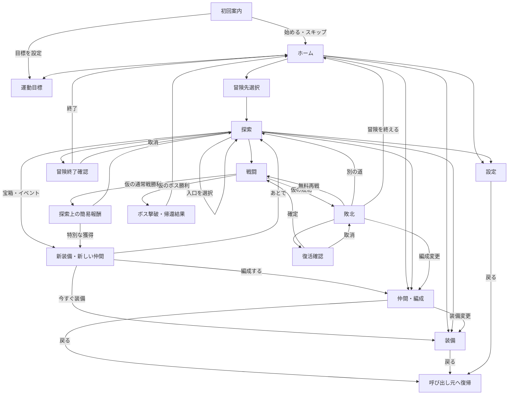

# 主要画面の遷移とUnityワイヤーの実装計画

状態：完了。ワイヤーの実装、Editorでの検証、Android APKのビルド・配置を完了した。端末での起動・操作評価は未確認。

[計画索引](README.md) / [画面仕様](../features/screens.md) / [UI設計ルール](../rules/ui-design.md)

## 目的と参照元

縦持ちのUnity上で、ボタンを押して画面を移動し、キャラ・装備を切り替えられるワイヤーを作る。
評価するのは、戦闘画面の窮屈さ、探索中の装備・仲間変更のしやすさ、戦闘下部の情報量である。

参照元は、2026-09-18に確認した会話[企画ワイヤー作成案](chatgpt-conversation://6aace9d2-c0d0-83e8-8a99-86843c758164)である。
会話後半のユーザー指定を優先し、会話内の数値例、キャラ名、アシスタントの提案を完成版の確定仕様にはしない。
今回の作業成果は実装計画とし、以下は実装に進む際の範囲・手順・受入条件を示す。

## 作る範囲

| 対象 | ワイヤーで動かす内容 |
|---|---|
| 画面遷移 | ホーム、冒険先、探索、戦闘、仲間・編成、装備、運動目標、設定をつなぐ |
| 戦闘 | 左右の配置、左側に味方4人を縦並び、下部のHP・スキル、上部の敵予告、選択状態の切り替え |
| 探索 | 固定の分岐・宝箱・イベントから表示を切り替え、探索中に装備・編成を変更する |
| 獲得 | 仮の新装備を装備画面、新しい仲間を編成画面へ渡し、その場で使えることを確認する |
| 勝敗 | 確認用の「仮：勝利」「仮：敗北」で、報酬・敗北・再戦・帰還へ進む |
| 状態差分 | 初回、目標未設定・進行中・達成済み、スキル選択、詠唱、クールダウン、敵ダウンなどを固定データで表示する |
| 保持する内容 | ワイヤー実行中だけ、探索場所、仮の獲得物、編成、装備、選択キャラ、戻り先を保持する |

ダメージ計算、自動攻撃、敵AI、時間経過によるキャスト・クールダウン・強スロー、ダウン判定、戦闘バランスは対象外とする。
戦闘ロジックを作る段階は、このワイヤーの評価後のVertical Sliceとして分ける。
探索の自動生成、本物の報酬抽選、育成計算、セーブ、サーバー同期、健康データ連携、課金も実装しない。
本番用のスプライト・モーション・SE・VFX・BGM・最終UIデザインの制作は含めない。

画面はグレー中心の箱、仮アイコン、読みやすい日本語で構成する。
選択状態と敵の濃淡を区別するための最小限の色を使い、キャラ絵の完成を待たずに配置を確認する。

## 参照会話と既存仕様の整理

| 項目 | 計画での扱い | 関連する正本 |
|---|---|---|
| 縦持ち・敵味方の左右配置 | 会話後半の指定を採用する。初期の上下配置案は使わない | [画面仕様](../features/screens.md) |
| 探索中の仲間・装備変更 | ユーザー指定として扱い、獲得直後から変更できる導線を作る | [パーティ](../features/party.md)・[装備](../features/equipment.md) |
| ダウンの見せ方 | 今回のワイヤーではリング・数値ゲージを置かず、敵の濃淡と状態差分で表す。既存のリング表示からの明示的な変更として扱う | [戦闘](../features/combat.md#hpとダウンの表示) |
| 戦闘中の編成・装備変更 | 会話内の提案をワイヤーの仮ルールとして採用し、進行中は開かない。敗北画面からは編成変更できる | [パーティ](../features/party.md)・[敗北時の選択](../features/combat.md#敗北と成果の保護) |
| 通常戦の報酬 | 独立した大きな結果画面を挟まず、探索上の簡易表示とする。ボス撃破時は帰還用の結果画面を使う | [画面仕様](../features/screens.md) |
| 敗北後 | 会話の簡略図を補い、無料再戦、復活確認、編成変更、別の道、帰還を用意する | [再戦と復活](../features/combat.md#無料再戦とルーン復活) |
| スキル数 | 基本は既存の戦闘試作に合わせて2枠。会話の3枠は窮屈さを調べる追加表示として用意する | [戦闘試作](../game/mvp.md#最初に作る戦闘試作) |
| キャスト表示 | 本体付近の「詠唱中」と下部の状態表示を試す。秒数をスキル説明へ常設する案は採用しない | [キャストタイム](../features/combat.md#キャストタイムの定義) |
| 運動目標 | 日次・週次の任意設定と90日／12週の達成実績を使う。会話中の「連続12日」などの例は使わない | [運動目標](../features/goals.md) |
| 15分のプレイフロー | 一連の導線の下地を作る。15分の連続プレイや、その長さのゲーム内容は要件にしない | [初回体験](../features/onboarding.md) |

今回は計画だけを追加し、正本のゲーム仕様や実装状況は変更しない。
実装時には、画面仕様へ採用した遷移・仮設定・実装範囲を記し、戦闘・パーティ・装備の対応箇所を同じ変更で更新する。
リングの変更は、戦闘仕様だけでなく、画面仕様・用語集・MVPなどの参照先も確認する。
敵HPと内部のダウン機構の区別は維持し、表示方法の変更を戦闘ルールの廃止として扱わない。

## 画面一覧と主要パーツ

画面IDと次の構成はワイヤー向けの提案である。
常設ナビは「ホーム・仲間・運動目標」の3項目から始め、装備はホームの入口と仲間詳細から、冒険はホームの主ボタンから、設定は右上から開く。
会話中の主要機能6種類を、そのまま6個の下部タブにはしない。
冒険中は常設ナビを隠し、探索専用の編成・装備・設定・終了操作に切り替える。

| ID | 画面 | 主な表示・操作 |
|---|---|---|
| W01 | ホーム | 仮の4人パーティ、所持ルーン、今日の運動進捗、「冒険する」、仲間、装備、運動目標、設定 |
| W02 | 冒険先選択 | 場所名、敵・お宝の短いヒント、未探索／続きの表示、行き先を選ぶ、ホームへ戻る |
| W03 | 探索 | 現在地、4人の仮配置、2つ程度の入口と短いヒント、宝箱・イベント、編成・装備への入口、メニュー |
| W04 | 仲間・編成 | 現在の4枠、仲間一覧、選択キャラの詳細、仮の入れ替え、装備を開く、呼び出し元へ戻る |
| W05 | 装備 | 対象キャラ、仮の装備枠、所持一覧、選択品と装備中の比較、変更の確定、戻る |
| W06 | 戦闘 | 敵予告、左右の戦場、味方4人のHP兼選択欄、選択キャラのスキル、対象の強調、状態差分 |
| W07 | 敗北 | 獲得済み成果を保持する案内、無料再戦、ルーン復活、編成変更、別の道、冒険を終える |
| W08 | ボス撃破・帰還結果 | 仮の獲得ルーン・装備、到達した場所、次の行き先の案内、ホームへ戻る |
| W09 | 運動目標 | 日次・週次の進捗、達成済み、難易度倍率と継続倍率、達成日数／週数、目標変更・履歴への入口 |
| W10 | 設定 | 音量などの仮操作、データ連携の案内への入口、呼び出し元へ戻る |

次の補助表示は別シーンを作らず、対応画面内のパネルまたはモーダルにする。

| 補助表示 | 入口と出口 |
|---|---|
| 初回案内 | ワイヤー初回起動→目標設定、またはスキップ→ホーム。認証や目標設定で冒険を阻まない |
| 通常報酬 | 通常戦の仮勝利→探索上の短い表示。通常品は次の探索操作を妨げない |
| 新装備・新しい仲間 | 「今すぐ装備」／「編成する」→該当画面。「あとで」→探索。あとで選んでも仮の所持一覧に残す |
| 復活確認 | 敗北→仮の消費量・成果保持の説明→確定で戦闘、取消で敗北。本物のルーンは消費しない |
| 冒険終了確認 | 探索→確認→ホーム。取消で同じ探索場所へ戻る |
| 目標編集・履歴 | 運動目標→固定の選択例・条件要約・変更予約、または過去のサンプル→運動目標 |
| データ連携案内 | 設定、または歩数以外の目標設定→説明→元の画面。OS設定・認証・実データ取得は呼ばない |

## 画面遷移



図の「呼び出し元」は、次の表の状態を含めて復元する。
画面上の戻るボタン、Androidの戻る、Editorの対応キーは、同じ戻る処理へつなぐ。

| 操作 | 戻る先と保持する内容 |
|---|---|
| ホーム→装備／仲間／設定 | ホーム。確定した仮の編成・装備をホーム表示へ反映する |
| 探索→装備／仲間／設定 | 同じ部屋・分岐の探索。装備変更を理由に部屋を進めたり冒険を終了したりしない |
| 探索→仲間→装備 | まず選択していた仲間へ戻り、その次に元の探索へ戻る |
| 獲得表示→装備／編成 | 獲得対象を選択済みで開く。確定後は探索へ戻る。取消時も獲得済みの品・仲間は保持する |
| 敗北→編成→装備 | 編成へ戻り、次に敗北へ戻る。再戦を選ぶまで戦闘を再開しない |
| モーダル表示中 | 最上面だけを閉じる。背面のクリック・スクロールを遮断する |
| スキル選択中 | 選択を取り消して戦闘の通常表示へ戻す。通常表示の戻る操作では探索へ抜けない |
| 初回→目標設定 | 完了・スキップでホームへ進む。通常時の目標編集取消は運動目標へ戻る |
| ホーム上の戻る | このワイヤーでは画面を維持する。アプリ終了の設計は対象外 |

冒険先選択の戻る先はホームとする。
仮の探索進捗は実行中のメモリに保持し、ホームから同じ冒険先を開くと「続きから」を試せるようにする。
PlayMode終了・アプリ再起動・確認用リセットで初期状態へ戻ることを案内し、永続保存済みとは表示しない。

## 戦闘ワイヤーの初期配置

```text
┌──────────────────────────┐
│ 敵の行動予告：敵名・技・対象    │
├──────────────────────────┤
│ 味方A □         □ 敵1  HP   │
│                            │
│ 味方B □ 詠唱中              │
│                  □ 敵2  HP │
│ 味方C □                    │
│                            │
│ 味方D □         □ 敵3  HP   │
├──────────────────────────┤
│ [顔 A] HP ━━━━━  選択中      │
│ [顔 B] HP ━━━━              │
│ [顔 C] HP ━━━━━             │
│ [顔 D] HP ━━━               │
│ 選択キャラ・選択中の技・対象   │
│ [スキル1] [スキル2]          │
└──────────────────────────┘
```

味方を左、敵を右に置き、戦場内の横幅は味方約1/3・敵約2/3から試す。
これは調整用の仮比率であり、完成寸法ではない。
味方本体と下部のHP行のどちらからも同じキャラを選択でき、スキル欄はそのキャラのものだけへ切り替わる。
選択中のキャラは本体・HP行・スキル欄で対応が分かるようにする。

スキル操作は「キャラ→スキル→対象→使用確定」を仮の手順とする。
スキル選択では、仮の威力・ダウン値・対象を小さな詳細欄に示す。
使用確定で選択表示を閉じて「詠唱中」のサンプルへ切り替えるが、敵のHPは減らさない。
強スローは選択中の表示だけを再現し、共通の戦闘時計や `Time.timeScale` の制御は作らない。

クールダウンはスキルボタンの暗転と固定の残り時間、キャストは本体付近とスキル欄の「詠唱中」で表す。
敵予告は敵名・技・対象を上部にまとめ、複数敵の予告を並べた状態も確認する。
敵のダウンは通常／弱った濃淡／ダウン中の仮表示を切り替え、成立中は短い状態ラベルも補助に使う。
ゲージ・リングは置かず、濃淡で状態を読み取れるかを評価する。

最初はHP4行とスキル2枠で確認する。
下部が戦場を圧迫する場合は、HP選択欄の2列配置を比較案とし、キャラ本体の縦並びは維持する。
通常の縦画面では敵予告、味方4人、HP4人分、スキルをスクロールなしで同時に確認できることを目標にする。
3スキル、長い技名、複数予告、単体の大きなボスを追加の厳しい表示条件として試す。

## 仮データと状態の切り替え

初期パーティ4人、獲得する仲間1人、比較できる装備数点、選べる場所2件、分岐・宝箱・通常戦・ボスの固定経路を用意する。
これらの数と名称はワイヤー専用で、ゲームマスタの確定を意味しない。
編成・装備の確定後は、次の探索・戦闘表示にも変更を反映する。
戦闘性能や所持制約の本格的な計算は行わず、入れ替え可能な組み合わせを固定データで示す。

確認用パネルから、初期状態へのリセット、仮勝利・敗北、通常敵／ボス、表示状態を再現できるようにする。
確認用パネルは普段閉じておき、ゲーム内のUI密度の評価に混ざらない位置・表示にする。
画面にはサンプルであることが分かる短い表示を置く。

| 対象 | 用意する状態 |
|---|---|
| ホーム・初回 | 初回案内、通常、目標未設定、目標達成 |
| 探索・獲得 | 分岐、宝箱、新装備、新しい仲間、装備・編成変更後、同じ場所からの再開 |
| 戦闘 | 通常、キャラ・技・対象の選択、詠唱、クールダウン、敵の濃淡・ダウン、通常戦勝利、ボス勝利、全滅 |
| 敗北 | 無料再戦は敵味方の初期HP、復活は敵の削れたHPと濃淡を維持した例。確認取消でも敗北状態を保持する |
| 目標 | 未設定、進行中、達成済みで超過実績あり、データ未確認、変更予約、過去履歴 |

目標編集は固定候補の選択と条件要約までとし、自由入力や倍率式・期間集計を作らない。
日次・週次を両方スキップでき、未設定を警告にしない。
歩数以外を選んだときの記録元・権限の案内は仮パネルで確認し、未確認データをゼロや未達に置き換えない。
音量など設定の仮操作は表示値だけを変え、実際の音声制御・端末設定・保存を行わない。

## 現在の実装と配置案

2026-09-18にコードと設定を確認した。
Unityは[ProjectVersion.txt](../../client/ProjectSettings/ProjectVersion.txt)の6000.6.0f1で、現在は`Main.unity`（削除済み）から健康データ画面を起動している。
[HealthScreenAssets](../../client/Assets/Baryonyx/Features/Health/Editor/HealthScreenAssets.cs)はuGUI・TextMeshPro・日本語フォントでPrefabを生成し、`HealthScreenBootstrap`（削除済み）がPresenterとViewを組み立てている。
RPGの画面・戦闘・探索コードはまだない。

ワイヤーもuGUIとTextMeshProを使い、専用シーン1つの中で画面パネルを切り替える。
既存のMainと健康データ画面はそのまま起動できるようにし、ワイヤー起動から健康データのProviderを呼ばない。
SafeArea・日本語表示・入力設定の既存方式を参考にするが、Health専用のPresenterやレイアウトへRPG処理を追加しない。
新しいUIパッケージや端末連携プラグインは必要としない。

以下はすべて今後の配置案であり、未作成である。

| 配置案 | 責務 |
|---|---|
| `client/Assets/Baryonyx/App/Scenes/Wireframe.unity` | ワイヤー用の起動シーン。CanvasとEventSystemを配置する |
| `client/Assets/Baryonyx/App/Runtime/WireframeBootstrap.cs` | 仮データ・状態・画面を組み立てる |
| `client/Assets/Baryonyx/App/Editor/WireframeSceneSetup.cs` | 生成済み画面をワイヤーシーンへ配置する |
| `client/Assets/Baryonyx/Features/Wireframe/Runtime/` | 画面ID、戻り先、実行中の状態、画面ごとの表示と入力 |
| `client/Assets/Baryonyx/Features/Wireframe/UI/` | 画面Prefabと専用の仮表示部品 |
| `client/Assets/Baryonyx/Features/Wireframe/Data/` | ワイヤー専用のサンプルデータ |
| `client/Assets/Baryonyx/Features/Wireframe/Editor/` | Prefab・サンプルデータの生成元 |
| `client/Assets/Baryonyx/Features/Wireframe/Tests/EditMode/` | 戻り先・状態保持・操作制限の検査 |
| `client/Assets/Baryonyx/Features/Wireframe/Tests/PlayMode/` | 実際のボタン入力から一連の導線を検査 |

試作用の画面と状態はWireframe機能内に集め、将来の本番用Combat・Party・Equipment基盤を先に作らない。
AppからWireframeを組み立てる依存方向とし、機能側はAppを参照しない。
Editorとテストには既存アセンブリへ所属する `.asmref` を置き、Runtimeへ混入させない。
アセットの生成・更新はUnityを通し、生成Prefabだけを手直しして生成元と食い違わせない。

## 実装の順序と確認する成果

| 順序 | 作業 | その時点で確認できること |
|---|---|---|
| 1 | 画面ID・戻り先・仮状態を定義し、専用シーン、SafeArea、共通ヘッダー・モーダルを作る | 空の画面間を移動し、呼び出し元へ戻れる。Mainの健康データ画面も従来どおり起動する |
| 2 | 戦闘の配置、HP兼キャラ選択、スキル切り替え、予告・詠唱・ダウンの表示を作る | 縦9:16と細長い縦画面で、情報量と操作域を最初に比較できる |
| 3 | ホーム→冒険先→探索→戦闘→獲得→装備・編成→探索をつなぐ | 拾った装備・仲間を使い、同じ探索場所へ戻れる |
| 4 | ボス・帰還、敗北・復活・無料再戦、初回、目標・設定と状態差分を追加する | 主導線と例外の戻り先を一通り確認できる |
| 5 | 入力テスト、画面比率・SafeAreaの目視確認、文書更新を行う | 操作可能なワイヤー、画面画像、確認結果と残課題を提出できる |

順序2と3を先に触って、HP欄の高さ・スキル欄の密度・装備変更の往復を調整する。
周辺画面を作り込んでから主要な配置の問題が見つかる進め方にはしない。

## 受入条件と検証

### 操作と状態

1. ホーム→冒険先→探索→通常戦→仮勝利→新装備→装備変更→探索→ボス→帰還を、ボタン操作だけで通せる。
2. 新しい仲間を獲得し、探索中に4人のうち1人と入れ替えると、探索・次の戦闘・ホームの表示へ反映される。
3. ホーム、探索、敗北から同じ装備・編成画面を開いても、それぞれ正しい場所へ戻る。多段の戻るとモーダル取消で選択や探索場所が消えない。
4. 4人それぞれを選ぶと、本体・HP欄の選択とスキル内容が一致する。スキル選択・取消・使用確定をしてもダメージ計算は走らない。
5. 戦闘中は編成・装備を開けず、敗北後は編成変更、無料再戦、復活確認の確定・取消、別の道、帰還を選べる。
6. 仮勝利や確定操作を連打しても、獲得表示の重複、仮の所持数の二重加算、余分な画面遷移が起きない。
7. 目標未設定・データ未確認・達成済みを区別し、初回の目標スキップでホームへ進める。
8. リセットで再現可能な初期状態に戻り、ネットワーク接続や個人の健康データなしで確認できる。

EditModeでは戻り先・状態保持・連打時の重複防止を、PlayModeでは実Prefabの入力から主導線と敗北後の導線を検査する。
実行方法と結果件数の確認は[Unityのテスト手順](../rules/client-testing.md)に従う。
C#変更後は再コンパイル完了とエラーの有無を確認し、テスト0件を合格としない。

### 配置と操作感

| 評価項目 | 確認方法 |
|---|---|
| 縦持ちの窮屈さ | 縦9:16、9:19.5、9:20で、予告・味方4人・敵・HP・スキルの重なりと圧迫を比較する |
| 下部の情報量 | 2スキル／3スキル、長い技名、複数予告、大きなボスを表示し、読める文字サイズで成立するかを見る |
| 探索中の変更 | 獲得表示から変更画面へ直接入り、確定後に同じ探索へ戻る。必要なタップ数と迷った箇所を記録する |
| 敵の濃淡 | 通常・弱った状態・ダウン中を切り替え、ゲージなしで違いが分かるか確認する |
| 機種差 | 320dp相当の幅、縦3:4、横4:3、非対称SafeArea、表示中のサイズ変更で操作へ到達できるか確認する |

寸法、最大幅、タップ領域、スクロールとモーダルの扱いは[UI設計ルール](../rules/ui-design.md)に従う。
通常の縦画面で戦闘の必須表示が収まらない場合は、文字を一律に縮小せず、欄の配置と情報の出し方を調整する。
強制的な横表示などでは操作への到達を保ち、縦画面の同時表示評価と分けて記録する。

Unity EditorのGameビューで確認し、画像は `client/Assets/DevCaptures/` に保存して開く。
自動テストの成功と、ユーザーが感じる窮屈さ・押しやすさの評価は分けて報告する。
端末確認が必要な段階では、ユーザーが手動で起動する `Pixel_8a_API_36` を使い、必要な操作・ログ確認を依頼する。
AIはエミュレーターを起動しない。

APKを作る場合はワイヤー用の起動シーンを明示して既存の `AndroidBuild.Build` を使い、通常のMain起動と混同しないようビルド対象を確認する。
生成成功後は[ルートのビルドルール](../../AGENTS.md#手動実行用ショートカット)に従い、`G:\マイドライブ\71_プロジェクト\baryonyx\baryonyx.apk` への上書きコピーまでを作業に含める。
今回の計画作成では、Unity操作・APKビルド・端末検証は実施しない。

## 実装後に決めること

評価後に、HP欄の並び方、戦場と下部UIの高さ、スキル選択のタップ数、常設ナビ、獲得表示の大きさを確定する。
ダウンの濃淡だけで状態が伝わるかも、仮表示を見た結果で判断する。
本番のキャラ・装備数、戦闘性能、復活費用、報酬式、保存・再開、健康データとの接続は別の設計課題として残す。

実装完了時には、[画面仕様](../features/screens.md)、関連する機能仕様、[機能索引](../features/README.md)、必要な[クライアント構成](../rules/frontend-design.md)を更新する。
ワイヤーで動く範囲を明記し、RPG機能が本実装済みであるとは記載しない。

## 2026-09-19の実装・検証記録

10画面、補助パネル、サンプルデータ、画面遷移、編成・装備・目標の仮状態を追加した。
専用のWireframeシーンとPrefabをUnity Editorで生成した。
戦闘のHP欄は短い縦画面で2列にし、選択した技の説明と使用ボタンを同じ行へまとめた。
画面生成は一時的なプレビューシーンで行い、既存シーンや無関係なアセットを一括保存しない。

元のUnity Editorが未保存のMainシーンを開いたまま応答待ちになっていたため、保存済みのAssets・Packages・ProjectSettingsを `client/.utmp/wireframe-build-20260919/` へコピーして検証した。
元の未保存シーンは保存・破棄していない。
コピー側でUnityが生成した専用Prefab・フォントは、GUIDの一致を確認して元の作業フォルダーへ反映した。

| 検査 | 結果 |
|---|---|
| Unityコンパイル・画面生成 | Unity 6000.6.0f1で成功 |
| C#の書式 | Wireframe機能と起動・生成の追加コード11ファイルで成功 |
| 文書 | リンク・ID・メタデータ・索引の検査に成功 |
| EditMode | 状態・戻り先・配置の19件が成功 |
| PlayMode | 仮想入力による4シナリオが成功。横画面で画面外のボタンを検査していたモーダルテストは、常に見えるヘッダーを対象に直して再実行した |
| Gameビュー | 実際のWireframeシーンを起動し、720×1280でホーム・装備・戦闘・ボスと3スキルを撮影して目視確認した |
| 画面比率・SafeArea | 9:16、9:19.5、9:20、3:4、4:3の非対称SafeAreaと、表示中のサイズ変更を自動検査した |
| Android端末 | 未実施。エミュレーターは起動していない |

テスト結果は `client/TestResults/wireframe-edit.xml`、`wireframe-play.xml`、`wireframe-modal.xml` に保存する。
`wireframe-play.xml` の初回モーダル失敗は、修正後の `wireframe-modal.xml` で解消を確認した。
画像は `client/Assets/DevCaptures/wireframe-*.png` に保存し、すべて仮データを使っている。

Androidは `WireframeSceneSetup.BuildAndroid` からWireframeだけを対象に、既存の `AndroidBuild.Build` を実行する。
通常のMain起動シーンの設定は維持する。
2026-09-19 00:49 JSTに、IL2CPP・ARM64のAPK生成と次の配置を完了した。

- 出力：`client/Builds/Android/baryonyx.apk`
- 配置先：`G:\マイドライブ\71_プロジェクト\baryonyx\baryonyx.apk`（上書き）
- サイズ：84,624,741バイト
- SHA-256：`7CFB772C62EB75D38C9E5D822D346D942C35C7B6938985D13542233492373035`

生成元・通常の出力先・Google Driveフォルダーの3ファイルでSHA-256の一致を確認した。
UnityのBuildReportはSucceededであり、収録シーンはWireframeのみ、処理後のビルド設定はMainに戻っている。
BuildReportに含まれるエラーログ1件は、ビルド要求を送ったPipelineの5秒の応答待ち超過である。
ビルド処理は継続し、完了結果とAPK生成を別途確認した。
Google Drive for desktopによるクラウド同期の完了と、端末上での起動・操作は未確認である。
